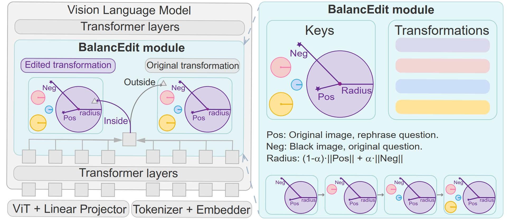

<div align="center">

# BalancEdit: Dynamically Balancing the Generality-Locality Trade-off in Multi-modal Model Editing

</div>

## Overview
This repo is based on an earlier version of EasyEdit. We edit the evaluation code and add our method.




## Requirements

#### Pip Installation

**Note: Please use Python 3.9+ for EasyEdit**
To get started, simply install conda and run:

```shell
git clone --branch MMOKVQA --single-branch https://github.com/donglgcn/EasyEdit.git
conda create -n EasyEdit python=3.9.7
...
pip install -r requirements.txt
```

## Backbone models:
Please refer to the EasyEdit repo or huggingface to download the backbone models.

## OKEDIT Dataset

OKEDIT is a benchmark dataset of knowledge editing for MLLMs. 
You can download the OKEDIT dataset from this [link](https://drive.google.com/drive/folders/1aauzm4Dxytpns8CKTPNJMpGhJ-mcqURF?usp=drive_link). Since it is based on COCO dataset, you may need to download images from there.


## Scripts
Before running the code, Please change the dataset directory to your own in the yaml config file and ```multimodal_edit.py```.

Usage:
```shell
python multimodal_edit.py -f {FUNCTIONNAME}
```
For example,
BalancEdit on OKVQA dataset by editing the MiniGPT4 model:
```shell
python multimodal_edit.py -f test_BalancEdit_MiniGPT4_OKVQA
```

BalancEdit on OKVQA dataset by editing the Blip2OPT model:
```shell
python multimodal_edit.py -f test_BalancEdit_BLIP2OPT_OKVQA
```
## Citation

Please cite our paper if you think it is useful.

```bibtex
@inproceedings{guo2025balancedit,
      title={BalancEdit: Dynamically Balancing the Generality-Locality Trade-off in Multi-modal Model Editing}, 
      author={Dongliang Guo and Mengxuan Hu and Zihan Guan and Thomas Hartvigsen and Sheng Li},
      booktitle={International Conference on Machine Learning},
      year={2025},
      url={https://arxiv.org/abs/2505.01343},
}
```

## Acknowledgement

We thank all the authors and contributors of EasyEdit for providing the codebase.

